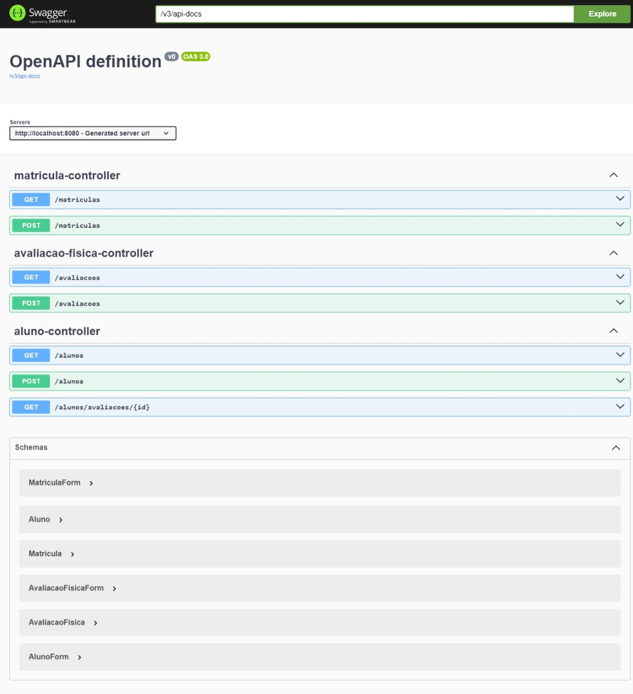

# API de Sistema de Academia

 API que simula a gestão de alunos numa academia

### Índice
* [Preview](#Preview)
* [Tecnologias](#Tecnologias)

## Preview

## Tecnologias

- Spring Boot 3
- Maven
- Spring Web
- Spring Data JPA
- MYSQL
- Springdoc
- Hibernate
- Lombok
- Git e GitHub

### Requisitos
- JDK 17 ou +
- Maven
- IDE
